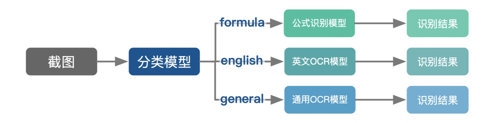

# Pix2Text

**Pix2Text** 期望完成 [Mathpix](https://mathpix.com/) 类似的功能，识别截屏图片中的数学公式、或者文字。它的流程如下：

  

Pix2Text首先利用图片分类模型来判断图片类型，然后基于不同的图片类型，把图片交由不同的解析系统进行文字解析：

1. 如果图片类型为 `formula` ，表示图片为数学公式，此时调用 [LaTeX-OCR](https://github.com/lukas-blecher/LaTeX-OCR) 识别图片中的数学公式，返回其Latex表示；
1. 如果图片类型为`english`，表示图片中包含的是英文文字，此时使用 [CnOCR](https://github.com/breezedeus/cnocr) 中的英文模型识别其中的英文文字；
1. 如果图片类型为`general`，表示图片中包含的是常见文字，此时使用 [CnOCR](https://github.com/breezedeus/cnocr) 中的通用模型识别其中的中或英文文字。