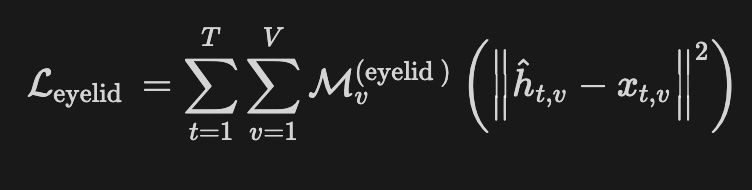
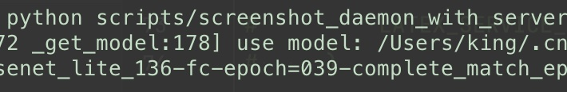

<div align="center">
  
  <div>&nbsp;</div>

[](https://pepy.tech/project/pix2text)
[](./LICENSE)
[](https://badge.fury.io/py/pix2text)
[](https://github.com/breezedeus/pix2text)
[](https://github.com/breezedeus/pix2text)


[](https://twitter.com/breezedeus)

[👩🏻‍💻网页版](https://p2t.breezedeus.com) |
[💬 交流群](https://www.breezedeus.com/join-group)

</div>

<div align="center">

[English](./README_en.md) | 中文


</div>

# Pix2Text (P2T)

## Update 2023.07.03：发布 V0.2.3

主要变更：
* 训练了新的**公式识别模型**，供 **[P2T网页版](https://p2t.breezedeus.com)** 使用。新模型精度更高，尤其对**手写公式**和**多行公式**类图片。具体参考：[Pix2Text 新版公式识别模型 | Breezedeus.com](https://www.breezedeus.com/article/p2t-mfd-20230702) 。
* 优化了对检测出的boxes的排序逻辑，以及对混合图片的处理逻辑，使得最终识别效果更符合直觉。
* 优化了识别结果的合并逻辑，自动判断是否该换行，是否分段。
* 修复了模型文件自动下载的功能。HuggingFace似乎对下载文件的逻辑做了调整，导致之前版本的自动下载失败，当前版本已修复。但由于HuggingFace国内被墙，国内下载仍需 **梯子（VPN）**。
* 更新了各个依赖包的版本号。

## Update 2023.06.20：发布新版 MFD 模型

主要变更：
* 基于新标注的数据，重新训练了 **MFD YoloV7** 模型，目前新模型已部署到 [P2T网页版](https://p2t.breezedeus.com) 。具体说明见：[Pix2Text (P2T) 新版公式检测模型 | Breezedeus.com](https://www.breezedeus.com/article/p2t-mfd-20230613) 。
* 之前的 MFD YoloV7 模型已开放给星球会员下载，具体说明见：[P2T YoloV7 数学公式检测模型开放给星球会员下载 | Breezedeus.com](https://www.breezedeus.com/article/p2t-yolov7-for-zsxq-20230619) 。

## Update 2023.02.10： **[P2T网页版](https://p2t.breezedeus.com)** 开放免费使用

* P2T作为Python包，对于不熟悉Python的朋友还是太不友好，所以我们也开发了 [P2T网页版](https://p2t.breezedeus.com)，可直接免费使用，欢迎帮忙推荐分享。
* 视频介绍：[Pix2Text 新版和网页版发布，离Mathpix又近了一大步_bilibili](https://www.bilibili.com/video/BV1U24y1q7n3) 。
* 文字版介绍：[Pix2Text (P2T) 新版发布，离Mathpix又近了一大步 - 知乎](https://zhuanlan.zhihu.com/p/604999678) 。


了解更多：[RELEASE.md](./RELEASE.md) 。

---


**Pix2Text** 期望成为 **[Mathpix](https://mathpix.com/)** 的**免费开源 Python **替代工具，目前已经可以完成 **Mathpix** 的核心功能。**Pix2Text (P2T)** 自 **V0.2** 开始，支持识别**既包含文字又包含公式的混合图片**，返回效果类似于 **Mathpix**。P2T 的核心原理见下图（文字识别支持**中文**和**英文**）：

<div align="center">
  
</div>


**P2T** 使用开源工具  **[CnSTD](https://github.com/breezedeus/cnstd)** 检测出图片中**数学公式**所在位置，再交由 **[LaTeX-OCR](https://github.com/lukas-blecher/LaTeX-OCR)** 识别出各对应位置数学公式的Latex表示。图片的剩余部分再交由 **[CnOCR](https://github.com/breezedeus/cnocr)** 进行文字检测和文字识别。最后 P2T 合并所有识别结果，获得最终的图片识别结果。感谢这些开源工具。


P2T 作为Python3工具包，对于不熟悉Python的朋友不太友好，所以我们也发布了**可免费使用**的 **[P2T网页版](https://p2t.breezedeus.com)**，直接把图片丢进网页就能输出P2T的解析结果。**网页版会使用最新的模型，效果会比开源模型更好。**


感兴趣的朋友欢迎扫码加小助手为好友，备注 `p2t`，小助手会定期统一邀请大家入群。群内会发布P2T相关工具的最新进展：

<div align="center">
  
</div>


作者也维护 **知识星球** [**P2T/CnOCR/CnSTD私享群**](https://t.zsxq.com/FEYZRJQ) ，这里面的提问会较快得到作者的回复，欢迎加入。**知识星球私享群**也会陆续发布一些P2T/CnOCR/CnSTD相关的私有资料，包括**部分未公开的模型**，**购买付费模型享优惠**，**不同应用场景的调用代码**，使用过程中遇到的难题解答等。星球也会发布P2T/OCR/STD相关的最新研究资料。


## 使用说明


调用很简单，以下是示例：

```python
from pix2text import Pix2Text, merge_line_texts

img_fp = './docs/examples/formula.jpg'
p2t = Pix2Text(analyzer_config=dict(model_name='mfd'))
outs = p2t(img_fp, resized_shape=600)  # 也可以使用 `p2t.recognize(img_fp)` 获得相同的结果
print(outs)
# 如果只需要识别出的文字和Latex表示，可以使用下面行的代码合并所有结果
only_text = merge_line_texts(outs, auto_line_break=True)
print(only_text)
```


返回结果 `outs` 是个 `dict`，其中 key `position` 表示Box位置信息，`type` 表示类别信息，而 `text` 表示识别的结果。具体见下面的[接口说明](#接口说明)。


## 示例

<table>
<tr>
<th> 图片 </th> 
<th> Pix2Text识别结果 </th>
</tr>
<tr>
<td>
 

</td>
<td>

```python
[{'line_number': 0,
  'position': array([[         22,          31],
       [       1057,          31],
       [       1057,          58],
       [         22,          58]]),
  'text': 'JVAE的训练loss和VQ-VAE类似，只是使用了KL距离来让分布尽量分散',
  'type': 'text'},
 {'line_number': 1,
  'position': array([[        625,         121],
       [       1388,         121],
       [       1388,         182],
       [        625,         182]]),
  'text': '$$\n'
          '-E_{z\\sim q(z\\mid x)}[\\log(p(x\\mid z))]+K L(q(z\\mid x))|p(z))\n'
          '$$',
  'type': 'isolated'},
 {'line_number': 2,
  'position': array([[         18,         242],
       [        470,         242],
       [        470,         275],
       [         18,         275]]),
  'text': '其中之利用 Gumbel-Softmax 人',
  'type': 'text'},
 {'line_number': 2,
  'position': array([[        481,         238],
       [        664,         238],
       [        664,         287],
       [        481,         287]]),
  'text': ' $z\\sim q(z|x)$ ',
  'type': 'embedding'},
 {'line_number': 2,
  'position': array([[        667,         244],
       [        840,         244],
       [        840,         277],
       [        667,         277]]),
  'text': '中抽样得到,',
  'type': 'text'},
 {'line_number': 2,
  'position': array([[        852,         239],
       [        932,         239],
       [        932,         288],
       [        852,         288]]),
  'text': ' $\\scriptstyle{p(z)}$ ',
  'type': 'embedding'},
 {'line_number': 2,
  'position': array([[        937,         244],
       [       1299,         244],
       [       1299,         277],
       [        937,         277]]),
  'text': '是个等概率的多项式分布',
  'type': 'text'}]
```

</td>
</tr>
<tr>
<td>

 
</td>
<td>

```python
[{"line_number": 0,
  "position": array([[         12,          19],
       [        749,          19],
       [        749,         150],
       [         12,         150]]),
  "text": "$$\n"
          "\\mathcal{L}_{\\mathrm{eyelid}}~\\equiv~"
          "\\sum_{t=1}^{T}\\sum_{v=1}^{V}"
          "\\mathcal{N}_{U}^{\\mathrm{(eyelid)}}"
          "\\left(\\left|\\left|\\hat{h}_{t,v}\\,-\\,"
          "\\mathcal{x}_{t,v}\\right|\\right|^{2}\\right)\n"
          "$$",
  "type": "isolated"}]
```
</div>
</td>
</tr>
<tr>
<td>

  
</td>
<td>

```python
[{"position": array([[          0,           0],
       [        710,           0],
       [        710,         116],
       [          0,         116]]),
  "text": "python scripts/screenshot_daemon_with_server\n"
          "2-get_model:178usemodel:/Users/king/.cr\n"
          "enet_lite_136-fc-epoch=039-complete_match_er",
  "type": "english"}]
```
</td>
</tr>
<tr>
<td>

  
</td>
<td>

```python
[{"position": array([[          0,           0],
       [        800,           0],
       [        800,         800],
       [          0,         800]]),
  "text": "618\n开门红提前购\n很贵\n买贵返差"
  "\n终于降价了\n100%桑蚕丝\n要买趁早\n今日下单188元\n仅限一天",
  "type": "general"}]
```
</td>
</tr>
</table>


## 模型下载

### 开源免费模型

安装好 Pix2Text 后，首次使用时系统会**自动下载** 免费模型文件，并存于 `~/.pix2text`目录（Windows下默认路径为 `C:\Users\<username>\AppData\Roaming\pix2text`）。


> **Note**
>
> 如果已成功运行上面的示例，说明模型已完成自动下载，可忽略本节后续内容。


对于**分类模型**，系统会自动下载模型`mobilenet_v2.zip`文件并对其解压，然后把解压后的模型相关目录放于`~/.pix2text`目录中。如果系统无法自动成功下载`mobilenet_v2.zip`文件，则需要手动从 **[cnstd-cnocr-models/pix2text](https://huggingface.co/breezedeus/cnstd-cnocr-models/tree/main/models/pix2text/0.2)** 下载此zip文件并把它放于 `~/.pix2text`目录。如果下载太慢，也可以从 [百度云盘](https://pan.baidu.com/s/1kubZF4JGE19d98NDoPHJzQ?pwd=p2t0) 下载， 提取码为 ` p2t0`。

对于  **[LaTeX-OCR](https://github.com/lukas-blecher/LaTeX-OCR)** ，系统同样会自动下载模型文件并把它们存放于`~/.pix2text/formula`目录中。如果系统无法自动成功下载这些模型文件，则需从  [百度云盘](https://pan.baidu.com/s/1kubZF4JGE19d98NDoPHJzQ?pwd=p2t0) 下载文件 `weights.pth` 和 `image_resizer.pth`， 并把它们存放于`~/.pix2text/formula`目录中；提取码为 ` p2t0`。


### 付费模型

除了上面免费的开源模型，P2T 也训练了精度更高的数学公式检测和识别模型，这些模型供 **[P2T网页版](https://p2t.breezedeus.com)** 使用，它们的效果也可以在网页版体验。这些模型不是免费的（抱歉开源作者也是要喝咖啡的），具体可参考 [Pix2Text (P2T) | Breezedeus.com](https://www.breezedeus.com/pix2text) 。


## 安装

嗯，顺利的话一行命令即可。

```bash
pip install pix2text
```

安装速度慢的话，可以指定国内的安装源，如使用豆瓣源：

```bash
pip install pix2text -i https://pypi.doubanio.com/simple
```


如果是初次使用**OpenCV**，那估计安装都不会很顺利，bless。

**Pix2Text** 主要依赖 [**CnSTD>=1.2.1**](https://github.com/breezedeus/cnstd)、[**CnOCR>=2.2.2.1**](https://github.com/breezedeus/cnocr) ，以及 [**LaTeX-OCR**](https://github.com/lukas-blecher/LaTeX-OCR) 。如果安装过程遇到问题，也可参考它们的安装说明文档。


> **Warning** 
>
> 如果电脑中从未安装过 `PyTorch`，`OpenCV` python包，初次安装可能会遇到不少问题，但一般都是常见问题，可以自行百度/Google解决。


## 接口说明

### 类初始化

主类为 [**Pix2Text**](pix2text/pix_to_text.py) ，其初始化函数如下：

```python
class Pix2Text(object):

    def __init__(
        self,
        *,
        analyzer_config: Dict[str, Any] = None,
        clf_config: Dict[str, Any] = None,
        general_config: Dict[str, Any] = None,
        english_config: Dict[str, Any] = None,
        formula_config: Dict[str, Any] = None,
        thresholds: Dict[str, Any] = None,
        device: str = 'cpu',  # ['cpu', 'cuda', 'gpu']
        **kwargs,
    ):
```

其中的各参数说明如下：
* `analyzer_config` (dict): 分类模型对应的配置信息；默认为 `None`，表示使用默认配置（使用**MFD** Analyzer）：
	
  ```python
  {
        'model_name': 'mfd'  # 可以取值为 'mfd'（MFD），或者 'layout'（版面分析）
	}
	```
	
* `clf_config` (dict): 分类模型对应的配置信息；默认为 `None`，表示使用默认配置：
	```python
  {
        'base_model_name': 'mobilenet_v2',
        'categories': IMAGE_TYPES,
        'transform_configs': {
            'crop_size': [150, 450],
            'resize_size': 160,
            'resize_max_size': 1000,
        },
        'model_dir': Path(data_dir()) / 'clf',
        'model_fp': None  # 如果指定，直接使用此模型文件
  }
	```
	
* `general_config` (dict): 通用模型对应的配置信息；默认为 `None`，表示使用默认配置：

  ```python
  {}
  ```

* `english_config` (dict): 英文模型对应的配置信息；默认为 `None`，表示使用默认配置：

  ```py
  {'det_model_name': 'en_PP-OCRv3_det', 'rec_model_name': 'en_PP-OCRv3'}
  ```

* `formula_config` (dict): 公式识别模型对应的配置信息；默认为 `None`，表示使用默认配置：

  ```python
  {
      'config': LATEX_CONFIG_FP,
      'model_fp': Path(data_dir()) / 'formula' / 'weights.pth',
      'no_resize': False
  }
  ```

* `thresholds` (dict): 识别阈值对应的配置信息；默认为 `None`，表示使用默认配置：

  ```py
  {
      'formula2general': 0.65,  # 如果识别为 `formula` 类型，但得分小于此阈值，则改为 `general` 类型
      'english2general': 0.75,  # 如果识别为 `english` 类型，但得分小于此阈值，则改为 `general` 类型
  }
  ```

* `device` (str): 使用什么资源进行计算，支持 `['cpu', 'cuda', 'gpu']`；默认为 `cpu`

* `**kwargs` (): 预留的其他参数；目前未被使用


### 识别类函数

通过调用类 **`Pix2Text`** 的类函数 `.recognize()` 完成对指定图片进行识别。类函数 `.recognize()` 说明如下：

```python
    def recognize(
        self, img: Union[str, Path, Image.Image], use_analyzer: bool = True, **kwargs
    ) -> List[Dict[str, Any]]:
```


其中的输入参数说明如下：

* `img` (`str` or `Image.Image`)：待识别图片的路径，或者利用 `Image.open()` 已读入的图片 `Image` 。
* `use_analyzer` (`bool`)：是否使用 Analyzer (**MFD** or **Layout**); `False` 表示把图片看成纯文本或者纯图片处理，相当于 **P2T V0.1.*** 的效果。Default: `True`。
* `kwargs`: 保留字段，可以包含以下值，
  * `resized_shape` (`int`): 把图片宽度resize到此大小再进行处理；默认值为 `700`；
  * `save_analysis_res` (`str`): 把解析结果图片存在此文件中；默认值为 `None`，表示不存储；
  * `embed_sep` (`tuple`): embedding latex的前后缀；只针对使用 `MFD` 时才有效；默认值为 `(' $', '$ ')`；
  * `isolated_sep` (`tuple`): isolated latex的前后缀；只针对使用 `MFD` 时才有效；默认值为 `('$$\n', '\n$$')`。


返回结果为列表（`list`），列表中的每个元素为`dict`，包含如下 `key`：

* `type`：识别出的图像类别；
  * 当开启Analyzer时（`use_analyzer==True`），取值为 `text`（纯文本）、`isolated`（独立行的数学公式） 或者 `embedding`（行内的数学公式）；
  
    >  注意：对于 **MFD Analyzer** ，此取值从 P2T **v0.2.3** 开始与之前不同。
  * 当未开启Analyzer时（`use_analyzer==False`），取值为`formula`（纯数学公式）、`english`（纯英文文字）、`general`（纯文字，可能包含中英文）；
  
* `text`：识别出的文字或Latex表达式；
* `position`：所在块的位置信息，`np.ndarray`, with shape of `[4, 2]`；
* `line_number`：仅在使用 **MFD Analyzer** 时，才会包含此字段。此字段为 Box 所在的行号（第一行 **`line_number=0`**），值相同的 Box 表示它们在同一行。

  > 注意：此取值从 P2T **v0.2.3** 开始才有，之前版本没有此 `key`。


`Pix2Text` 类也实现了 `__call__()` 函数，其功能与 `.recognize()` 函数完全相同。所以才会有以下的调用方式：

```python
from pix2text import Pix2Text, merge_line_texts

img_fp = './docs/examples/formula.jpg'
p2t = Pix2Text(analyzer_config=dict(model_name='mfd'))
outs = p2t(img_fp, resized_shape=608)  # 也可以使用 `p2t.recognize(img_fp)` 获得相同的结果
print(outs)
# 如果只需要识别出的文字和Latex表示，可以使用下面行的代码合并所有结果
only_text = merge_line_texts(outs, auto_line_break=True)
print(only_text)
```


## 脚本使用

**P2T** 包含了以下命令行工具。


### 对单张图片或单个文件夹中的图片进行识别

使用命令 **`p2t predict`** 预测单张图片或文件夹中所有图片，以下是使用说明：

```bash
$ p2t predict -h
Usage: p2t predict [OPTIONS]

  模型预测

Options:
  --use-analyzer / --no-use-analyzer
                                  是否使用 MFD 或者版面分析 Analyzer  [default: use-
                                  analyzer]
  -a, --analyzer-name [mfd|layout]
                                  使用哪个Analyzer，MFD还是版面分析  [default: mfd]
  -t, --analyzer-type TEXT        Analyzer使用哪个模型，'yolov7_tiny' or 'yolov7'
                                  [default: yolov7_tiny]
  --analyzer-model-fp TEXT        Analyzer检测模型的文件路径。Default：`None`，表示使用默认模型
  --latex-ocr-model-fp TEXT       Latex-OCR
                                  数学公式识别模型的文件路径。Default：`None`，表示使用默认模型
  -d, --device TEXT               使用 `cpu` 还是 `gpu` 运行代码，也可指定为特定gpu，如`cuda:0`
                                  [default: cpu]
  --resized-shape INTEGER         把图片宽度resize到此大小再进行处理  [default: 608]
  -i, --img-file-or-dir TEXT      输入图片的文件路径或者指定的文件夹  [required]
  --save-analysis-res TEXT        把解析结果存储到此文件或目录中（如果'--img-file-or-
                                  dir'为文件/文件夹，则'--save-analysis-
                                  res'也应该是文件/文件夹）。取值为 `None` 表示不存储
  -l, --log-level TEXT            Log Level, such as `INFO`, `DEBUG`
                                  [default: INFO]
  -h, --help                      Show this message and exit.
```


此命令可用于**打印对指定图片的检测和识别结果**，如运行：

```bash
$ p2t predict --use-analyzer -a mfd --resized-shape 608 -i docs/examples/en1.jpg --save-analysis-res output-en1.jpg
```

上面命令打印出识别结果，同时会把检测结果存储在 `output-en1.jpg` 文件中，类似以下效果：


<div align="center">
  
</div>


## HTTP服务

 **Pix2Text** 加入了基于 FastAPI 的HTTP服务。开启服务需要安装几个额外的包，可以使用以下命令安装：

```bash
$ pip install pix2text[serve]
```


安装完成后，可以通过以下命令启动HTTP服务（**`-p`** 后面的数字是**端口**，可以根据需要自行调整）：

```bash
$ p2t serve -p 8503
```


`p2t serve` 命令使用说明：

```bash
$ p2t serve -h
Usage: p2t serve [OPTIONS]

  开启HTTP服务。

Options:
  -H, --host TEXT     server host  [default: 0.0.0.0]
  -p, --port INTEGER  server port  [default: 8503]
  --reload            whether to reload the server when the codes have been
                      changed
  -h, --help          Show this message and exit.
```


服务开启后，可以使用以下方式调用服务。


### 命令行

比如待识别文件为 `docs/examples/mixed.jpg`，如下使用 `curl` 调用服务：

```bash
$ curl -F image=@docs/examples/mixed.jpg --form 'use_analyzer=true' --form 'resized_shape=600' http://0.0.0.0:8503/pix2text
```


### Python

使用如下方式调用服务，参考文件 [scripts/try_service.py](scripts/try_service.py)：

```python
import requests

url = 'http://0.0.0.0:8503/pix2text'

image_fp = 'docs/examples/mixed.jpg'
data = {
    "use_analyzer": True,
    "resized_shape": 608,
    "embed_sep": " $,$ ",
    "isolated_sep": "$$\n, \n$$"
}
files = {
    "image": (image_fp, open(image_fp, 'rb'))
}

r = requests.post(url, data=data, files=files)

outs = r.json()['results']
only_text = '\n'.join([out['text'] for out in outs])
print(f'{only_text=}')
```


### 其他语言

请参照 `curl` 的调用方式自行实现。


## 脚本运行

脚本 [scripts/screenshot_daemon.py](scripts/screenshot_daemon.py) 实现了自动对截屏图片调用 Pixe2Text 进行公式或者文字识别。这个功能是如何实现的呢？


**以下是具体的运行流程（请先安装好 Pix2Text）：**

1. 找一个喜欢的截屏软件，这个软件只要**支持把截屏图片存储在指定文件夹**即可。比如Mac下免费的 **Xnip** 就很好用。

2. 除了安装Pix2Text外，还需要额外安装一个Python包 **pyperclip**，利用它把识别结果复制进系统的剪切板：

   ```bash
   $ pip install pyperclip
   ```

3. 下载脚本文件 [scripts/screenshot_daemon.py](scripts/screenshot_daemon.py) 到本地，编辑此文件 `"SCREENSHOT_DIR"` 所在行（第 `17` 行），把路径改为你的截屏图片所存储的目录。

4. 运行此脚本：

   ```bash
   $ python scripts/screenshot_daemon.py
   ```

好了，现在就用你的截屏软件试试效果吧。截屏后的识别结果会写入电脑剪切板，直接 **Ctrl-V** / **Cmd-V** 即可粘贴使用。


更详细使用介绍可参考视频：《[Pix2Text: 替代 Mathpix 的免费 Python 开源工具](https://www.bilibili.com/video/BV12e4y1871U)》。


## 给作者来杯咖啡

开源不易，如果此项目对您有帮助，可以考虑 [给作者加点油🥤，鼓鼓气💪🏻](https://www.breezedeus.com/buy-me-coffee) 。

---

官方代码库：[https://github.com/breezedeus/pix2text](https://github.com/breezedeus/pix2text) 。

Pix2Text (P2T) 更多信息：[https://www.breezedeus.com/pix2text](https://www.breezedeus.com/pix2text) 。

