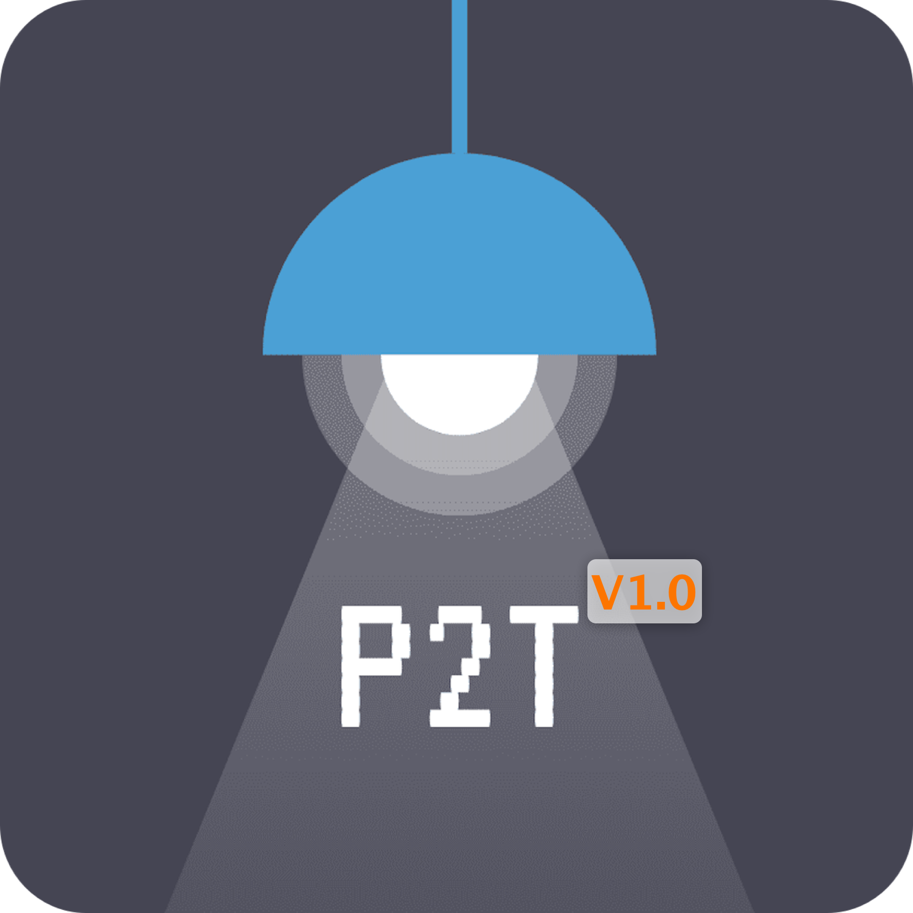
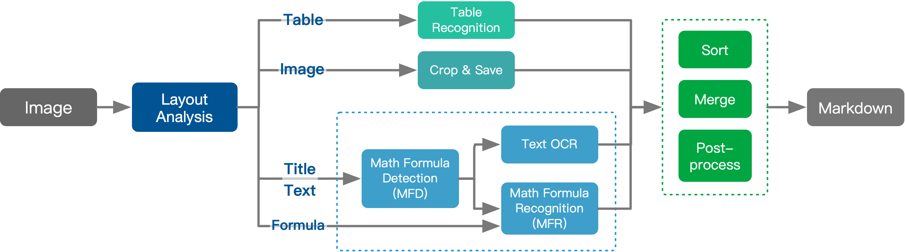

<div align="center">
  
  <div>&nbsp;</div>

[](https://discord.gg/GgD87WM8Tf)
[](https://pepy.tech/project/pix2text)
[](https://visitorbadge.io/status?path=https%3A%2F%2Fgithub.com%2Fbreezedeus%2FPix2Text)
[](./LICENSE)
[](https://badge.fury.io/py/pix2text)
[](https://github.com/breezedeus/pix2text)
[](https://github.com/breezedeus/pix2text)


[](https://twitter.com/breezedeus)

[📖 Doc](https://pix2text.readthedocs.io) |
[👩🏻‍💻 Online Service](https://p2t.breezedeus.com) |
[👨🏻‍💻 Demo](https://huggingface.co/spaces/breezedeus/Pix2Text-Demo) |
[💬 Contact](https://www.breezedeus.com/article/join-group)

</div>

<div align="center">

[中文](./README_cn.md) | English

</div>


# Pix2Text

## Update 2025.04.15: **V1.1.3** Released

Major Changes:

- Support for `VlmTableOCR` and `VlmTextFormulaOCR` models based on the VLM interface (see [LiteLLM documentation](https://docs.litellm.ai/docs/)) allowing the use of closed-source VLM models. Installation command: `pip install pix2text[vlm]`.
  - Usage examples can be found in [tests/test_vlm.py](tests/test_vlm.py) and [tests/test_pix2text.py](tests/test_pix2text.py).

## Update 2024.11.17: **V1.1.2** Released

Major Changes:

* A new layout analysis model [DocLayout-YOLO](https://github.com/opendatalab/DocLayout-YOLO) has been integrated, improving the accuracy of layout analysis.

## Update 2024.06.18：**V1.1.1** Released

Major changes:

* Support the new mathematical formula detection models (MFD): [breezedeus/pix2text-mfd](https://huggingface.co/breezedeus/pix2text-mfd) ([Mirror](https://hf-mirror.com/breezedeus/pix2text-mfd)), which significantly improves the accuracy of formula detection.

See details: [Pix2Text V1.1.1 Released, Bringing Better Mathematical Formula Detection Models | Breezedeus.com](https://www.breezedeus.com/article/p2t-mfd-v1.1.1).

## Update 2024.04.28: **V1.1** Released

Major changes:

* Added layout analysis and table recognition models, supporting the conversion of images with complex layouts into Markdown format. See examples: [Pix2Text Online Documentation / Examples](https://pix2text.readthedocs.io/zh-cn/stable/examples_en/).
* Added support for converting entire PDF files to Markdown format. See examples: [Pix2Text Online Documentation / Examples](https://pix2text.readthedocs.io/zh-cn/stable/examples_en/).
* Enhanced the interface with more features, including adjustments to existing interface parameters.
* Launched the [Pix2Text Online Documentation](https://pix2text.readthedocs.io).

## Update 2024.02.26: **V1.0** Released

Main Changes:

* The Mathematical Formula Recognition (MFR) model employs a new architecture and has been trained on a new dataset, achieving state-of-the-art (SOTA) accuracy. For detailed information, please see: [Pix2Text V1.0 New Release: The Best Open-Source Formula Recognition Model | Breezedeus.com](https://www.breezedeus.com/article/p2t-v1.0).

See more at: [RELEASE.md](docs/RELEASE.md) .

<br/>

**Pix2Text (P2T)** aims to be a **free and open-source Python** alternative to **[Mathpix](https://mathpix.com/)**, and it can already accomplish **Mathpix**'s core functionality. **Pix2Text (P2T) can recognize layouts, tables, images, text, mathematical formulas, and integrate all of these contents into Markdown format. P2T can also convert an entire PDF file (which can contain scanned images or any other format) into Markdown format.**

**Pix2Text (P2T)** integrates the following models:

- **Layout Analysis Model**: [breezedeus/pix2text-layout](https://huggingface.co/breezedeus/pix2text-layout) ([Mirror](https://hf-mirror.com/breezedeus/pix2text-layout)).
- **Table Recognition Model**: [breezedeus/pix2text-table-rec](https://huggingface.co/breezedeus/pix2text-table-rec) ([Mirror](https://hf-mirror.com/breezedeus/pix2text-table-rec)).
- **Text Recognition Engine**: Supports **80+ languages** such as **English, Simplified Chinese, Traditional Chinese, Vietnamese**, etc. For English and Simplified Chinese recognition, it uses the open-source OCR tool [CnOCR](https://github.com/breezedeus/cnocr), while for other languages, it uses the open-source OCR tool [EasyOCR](https://github.com/JaidedAI/EasyOCR).
- **Mathematical Formula Detection Model (MFD)**: [breezedeus/pix2text-mfd](https://huggingface.co/breezedeus/pix2text-mfd) ([Mirror](https://hf-mirror.com/breezedeus/pix2text-mfd)). Implemented based on [CnSTD](https://github.com/breezedeus/cnstd).
- **Mathematical Formula Recognition Model (MFR)**: [breezedeus/pix2text-mfr](https://huggingface.co/breezedeus/pix2text-mfr) ([Mirror](https://hf-mirror.com/breezedeus/pix2text-mfr)).

Several models are contributed by other open-source authors, and their contributions are highly appreciated.

<div align="center">
  
</div>

For detailed explanations, please refer to the [Pix2Text Online Documentation/Models](https://pix2text.readthedocs.io/zh-cn/stable/models/).

<br/>

As a Python3 toolkit, P2T may not be very user-friendly for those who are not familiar with Python. Therefore, we also provide a **[free-to-use P2T Online Web](https://p2t.breezedeus.com)**, where you can directly upload images and get P2T parsing results. The web version uses the latest models, resulting in better performance compared to the open-source models.

If you're interested, feel free to add the assistant as a friend by scanning the QR code and mentioning `p2t`. The assistant will regularly invite everyone to join the group where the latest developments related to P2T tools will be announced:

<div align="center">
  
</div>

The author also maintains a **Knowledge Planet** [**P2T/CnOCR/CnSTD Private Group**](https://t.zsxq.com/FEYZRJQ), where questions are answered promptly. You're welcome to join. The **knowledge planet private group** will also gradually release some private materials related to P2T/CnOCR/CnSTD, including **some unreleased models**, **discounts on purchasing premium models**, **code snippets for different application scenarios**, and answers to difficult problems encountered during use. The planet will also publish the latest research materials related to P2T/OCR/STD.

For more contact method, please refer to [Contact](https://pix2text.readthedocs.io/zh-cn/stable/contact/).


## List of Supported Languages

The text recognition engine of Pix2Text supports **`80+` languages**, including **English, Simplified Chinese, Traditional Chinese, Vietnamese**, etc. Among these, **English** and **Simplified Chinese** recognition utilize the open-source OCR tool **[CnOCR](https://github.com/breezedeus/cnocr)**, while recognition for other languages employs the open-source OCR tool **[EasyOCR](https://github.com/JaidedAI/EasyOCR)**. Special thanks to the respective authors.

List of **Supported Languages** and **Language Codes** are shown below:

<details>
<summary>↓↓↓ Click to show details ↓↓↓</summary>

| Language            | Code Name   |
| ------------------- | ----------- |
| Abaza               | abq         |
| Adyghe              | ady         |
| Afrikaans           | af          |
| Angika              | ang         |
| Arabic              | ar          |
| Assamese            | as          |
| Avar                | ava         |
| Azerbaijani         | az          |
| Belarusian          | be          |
| Bulgarian           | bg          |
| Bihari              | bh          |
| Bhojpuri            | bho         |
| Bengali             | bn          |
| Bosnian             | bs          |
| Simplified Chinese  | ch_sim      |
| Traditional Chinese | ch_tra      |
| Chechen             | che         |
| Czech               | cs          |
| Welsh               | cy          |
| Danish              | da          |
| Dargwa              | dar         |
| German              | de          |
| English             | en          |
| Spanish             | es          |
| Estonian            | et          |
| Persian (Farsi)     | fa          |
| French              | fr          |
| Irish               | ga          |
| Goan Konkani        | gom         |
| Hindi               | hi          |
| Croatian            | hr          |
| Hungarian           | hu          |
| Indonesian          | id          |
| Ingush              | inh         |
| Icelandic           | is          |
| Italian             | it          |
| Japanese            | ja          |
| Kabardian           | kbd         |
| Kannada             | kn          |
| Korean              | ko          |
| Kurdish             | ku          |
| Latin               | la          |
| Lak                 | lbe         |
| Lezghian            | lez         |
| Lithuanian          | lt          |
| Latvian             | lv          |
| Magahi              | mah         |
| Maithili            | mai         |
| Maori               | mi          |
| Mongolian           | mn          |
| Marathi             | mr          |
| Malay               | ms          |
| Maltese             | mt          |
| Nepali              | ne          |
| Newari              | new         |
| Dutch               | nl          |
| Norwegian           | no          |
| Occitan             | oc          |
| Pali                | pi          |
| Polish              | pl          |
| Portuguese          | pt          |
| Romanian            | ro          |
| Russian             | ru          |
| Serbian (cyrillic)  | rs_cyrillic |
| Serbian (latin)     | rs_latin    |
| Nagpuri             | sck         |
| Slovak              | sk          |
| Slovenian           | sl          |
| Albanian            | sq          |
| Swedish             | sv          |
| Swahili             | sw          |
| Tamil               | ta          |
| Tabassaran          | tab         |
| Telugu              | te          |
| Thai                | th          |
| Tajik               | tjk         |
| Tagalog             | tl          |
| Turkish             | tr          |
| Uyghur              | ug          |
| Ukranian            | uk          |
| Urdu                | ur          |
| Uzbek               | uz          |
| Vietnamese          | vi          |


> Ref: [Supported Languages](https://www.jaided.ai/easyocr/) .

</details>


## Online Service

Everyone can use the **[P2T Online Service](https://p2t.breezedeus.com)** for free, with a daily limit of 10,000 characters per account, which should be sufficient for normal use. *Please refrain from bulk API calls, as machine resources are limited, and this could prevent others from accessing the service.*

Due to hardware constraints, the Online Service currently only supports **Simplified Chinese** and **English** languages. To try the models in other languages, please use the following **Online Demo**.

## Online Demo 🤗

You can also try the **[Online Demo](https://huggingface.co/spaces/breezedeus/Pix2Text-Demo)** to see the performance of **P2T** in various languages. However, the online demo operates on lower hardware specifications and may be slower. For Simplified Chinese or English images, it is recommended to use the **[P2T Online Service](https://p2t.breezedeus.com)**.

## Examples

See: [Pix2Text Online Documentation/Examples](https://pix2text.readthedocs.io/zh-cn/stable/examples_en/).

## Usage

See: [Pix2Text Online Documentation/Usage](https://pix2text.readthedocs.io/zh-cn/stable/usage/).

## Models

See: [Pix2Text Online Documentation/Models](https://pix2text.readthedocs.io/zh-cn/stable/models/).

## Install

Well, one line of command is enough if it goes well.

```bash
pip install pix2text
```

If you need to recognize languages other than **English** and **Simplified Chinese**, please use the following command to install additional packages:

```bash
pip install pix2text[multilingual]
```

If the installation is slow, you can specify an installation source, such as using the Aliyun source: 

```bash
pip install pix2text -i https://mirrors.aliyun.com/pypi/simple
```

For more information, please refer to: [Pix2Text Online Documentation/Install](https://pix2text.readthedocs.io/zh-cn/stable/install/).

## Command Line Tool

See: [Pix2Text Online Documentation/Command Tool](https://pix2text.readthedocs.io/zh-cn/stable/command/).

## HTTP Service

See: [Pix2Text Online Documentation/Command Tool/Start Service](https://pix2text.readthedocs.io/zh-cn/stable/command/).


## MacOS Desktop Application

Please refer to [Pix2Text-Mac](https://github.com/breezedeus/Pix2Text-Mac) for installing the Pix2Text Desktop App for MacOS.

<div align="center">
  
</div>


## A cup of coffee for the author

It is not easy to maintain and evolve the project, so if it is helpful to you, please consider [offering the author a cup of coffee 🥤](https://www.breezedeus.com/article/buy-me-coffee).

---

Official code base: [https://github.com/breezedeus/pix2text](https://github.com/breezedeus/pix2text). Please cite it properly.

For more information on Pix2Text (P2T), visit: [https://www.breezedeus.com/article/pix2text](https://www.breezedeus.com/article/pix2text).
