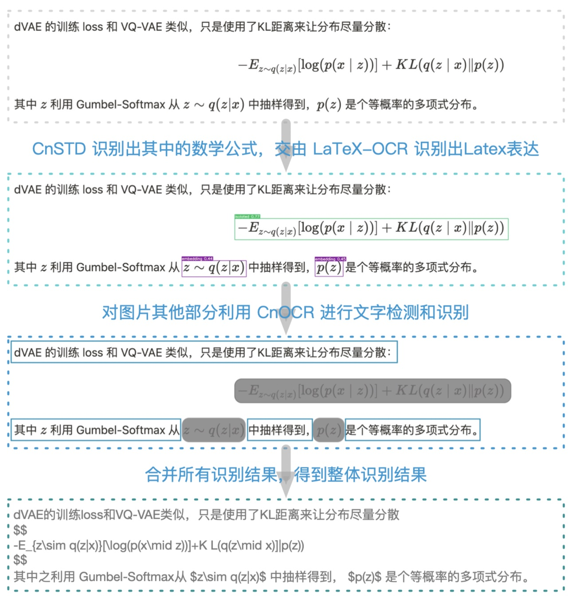
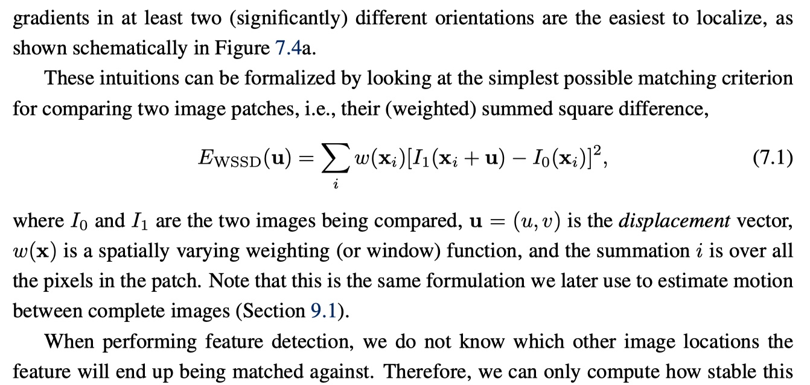
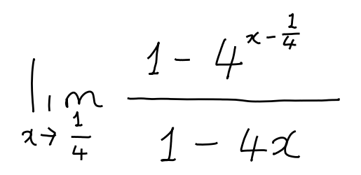
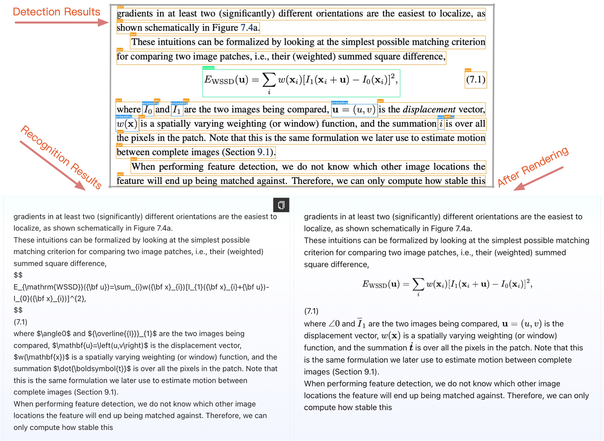
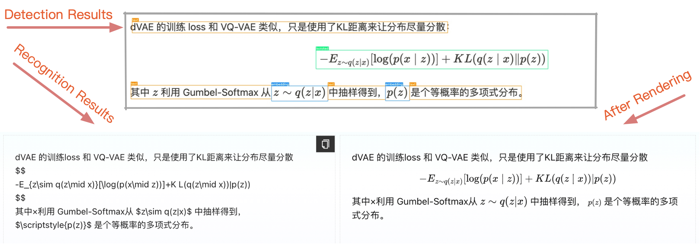
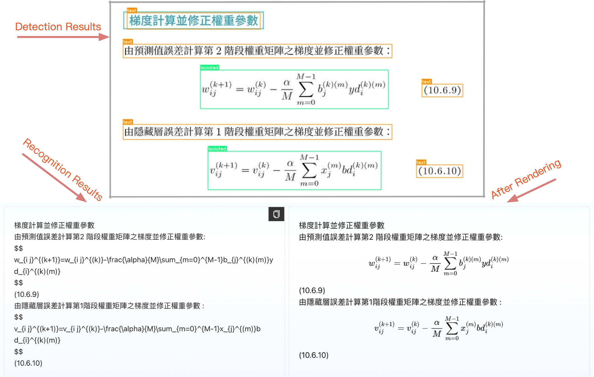
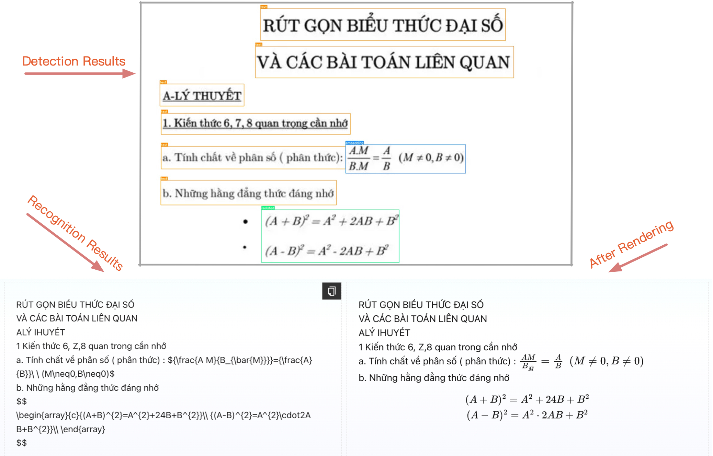
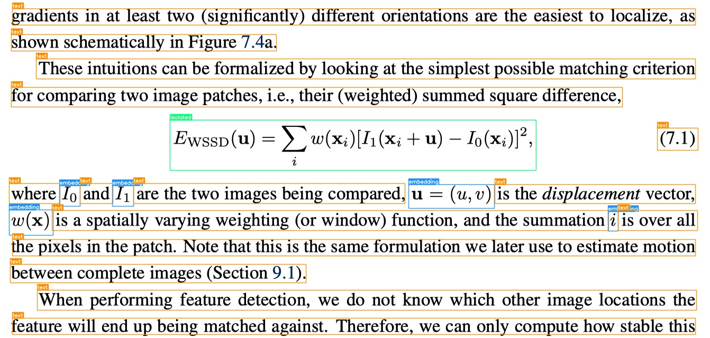

<div align="center">
  
  <div>&nbsp;</div>

[](https://discord.gg/tGuFEybd)
[](https://pepy.tech/project/pix2text)
[](https://visitorbadge.io/status?path=https%3A%2F%2Fgithub.com%2Fbreezedeus%2FPix2Text)
[](./LICENSE)
[](https://badge.fury.io/py/pix2text)
[](https://github.com/breezedeus/pix2text)
[](https://github.com/breezedeus/pix2text)


[](https://twitter.com/breezedeus)

[👩🏻‍💻 Online Demo](https://p2t.breezedeus.com) |
[💬 Contact](https://www.breezedeus.com/join-group)

</div>

<div align="center">

[中文](./README_cn.md) | English

</div>


# Pix2Text

## Update 2024.02.26: **V1.0** Released

Main Changes:

* The Mathematical Formula Recognition (MFR) model employs a new architecture and has been trained on a new dataset, achieving state-of-the-art (SOTA) accuracy. For detailed information, please see: [Pix2Text V1.0 New Release: The Best Open-Source Formula Recognition Model | Breezedeus.com](https://www.breezedeus.com/article/p2t-v1.0).

## Update 2024.01.10: **V0.3** Released

Major Changes:

* Support for recognizing **`80+` languages**; for a detailed list of supported languages, see [List of Supported Languages](#list-of-supported-languages);
* Added domestic sites for automatic model downloads;
* Optimized the logic for merging detection boxes.

## Update 2023.07.03: V0.2.3 Released 

Major changes:

- Trained a new **formula recognition model** for **[P2T Online Service](https://p2t.breezedeus.com/)** to use. The new model has higher accuracy, especially for **handwritten formulas** and **multi-line formulas**. See: [New Formula Recognition Model for Pix2Text | Breezedeus.com](https://www.breezedeus.com/article/p2t-mfd-20230702).
- Optimized the sorting logic of detected boxes and the processing logic of mixed images to make the final recognition results more intuitive.
- Optimized the merging logic of recognition results to automatically determine line breaks and paragraph breaks.

See more at: [RELEASE.md](./RELEASE.md) .


**Pix2Text (P2T)** aims to be a **free and open-source Python** alternative to **[Mathpix](https://mathpix.com/)**. It can already complete the core functionalities of **Mathpix**. Starting from **V0.2**, **Pix2Text (P2T)** supports recognizing **mixed images containing both text and formulas**, with output similar to **Mathpix**. The core principles of P2T are shown below (text recognition supports both **Chinese** and **English**):

<div align="center">  </div>

**P2T** utilizes the open-source tool **[CnSTD](https://github.com/breezedeus/cnstd)** to detect the locations of **mathematical formulas** in images. These detected areas are then processed by **P2T**'s own **formula recognition engine (LatexOCR)** to recognize the LaTeX representation of each mathematical formula. The remaining parts of the image are processed by a **text recognition engine ([CnOCR](https://github.com/breezedeus/cnocr) or [EasyOCR](https://github.com/JaidedAI/EasyOCR))** for text detection and recognition. Finally, **P2T** merges all recognition results to obtain the final image recognition outcome. Thanks to these great open-source projects!

For beginners who are not familiar with Python, we also provide the **free-to-use** [P2T Online Service](https://p2t.breezedeus.com/). Just upload your image and it will output the P2T parsing results. **The online service uses the latest models and works better than the open-source ones.**

If interested, please scan the QR code below to add the assistant WeChat account, and send `p2t` to get invited to the P2T user group. The group shares the latest updates of P2T and related tools:

<div align="center">  </div>


The author also maintains **Planet of Knowledge** [**P2T/CnOCR/CnSTD Private Group**](https://t.zsxq.com/FEYZRJQ), welcome to join. The **Planet of Knowledge Private Group** will release some P2T/CnOCR/CnSTD related private materials one after another, including **non-public models**, **discount for paid models**, answers to problems encountered during usage, etc. This group also releases the latest research materials related to VIE/OCR/STD.

## List of Supported Languages

The text recognition engine of Pix2Text supports **`80+` languages**, including **English, Simplified Chinese, Traditional Chinese, Vietnamese**, etc. Among these, **English** and **Simplified Chinese** recognition utilize the open-source OCR tool **[CnOCR](https://github.com/breezedeus/cnocr)**, while recognition for other languages employs the open-source OCR tool **[EasyOCR](https://github.com/JaidedAI/EasyOCR)**. Special thanks to the respective authors.

List of **Supported Languages** and **Language Codes** are shown below:

<details>
<summary>↓↓↓ Click to show details ↓↓↓</summary>

| Language            | Code Name   |
| ------------------- | ----------- |
| Abaza               | abq         |
| Adyghe              | ady         |
| Afrikaans           | af          |
| Angika              | ang         |
| Arabic              | ar          |
| Assamese            | as          |
| Avar                | ava         |
| Azerbaijani         | az          |
| Belarusian          | be          |
| Bulgarian           | bg          |
| Bihari              | bh          |
| Bhojpuri            | bho         |
| Bengali             | bn          |
| Bosnian             | bs          |
| Simplified Chinese  | ch_sim      |
| Traditional Chinese | ch_tra      |
| Chechen             | che         |
| Czech               | cs          |
| Welsh               | cy          |
| Danish              | da          |
| Dargwa              | dar         |
| German              | de          |
| English             | en          |
| Spanish             | es          |
| Estonian            | et          |
| Persian (Farsi)     | fa          |
| French              | fr          |
| Irish               | ga          |
| Goan Konkani        | gom         |
| Hindi               | hi          |
| Croatian            | hr          |
| Hungarian           | hu          |
| Indonesian          | id          |
| Ingush              | inh         |
| Icelandic           | is          |
| Italian             | it          |
| Japanese            | ja          |
| Kabardian           | kbd         |
| Kannada             | kn          |
| Korean              | ko          |
| Kurdish             | ku          |
| Latin               | la          |
| Lak                 | lbe         |
| Lezghian            | lez         |
| Lithuanian          | lt          |
| Latvian             | lv          |
| Magahi              | mah         |
| Maithili            | mai         |
| Maori               | mi          |
| Mongolian           | mn          |
| Marathi             | mr          |
| Malay               | ms          |
| Maltese             | mt          |
| Nepali              | ne          |
| Newari              | new         |
| Dutch               | nl          |
| Norwegian           | no          |
| Occitan             | oc          |
| Pali                | pi          |
| Polish              | pl          |
| Portuguese          | pt          |
| Romanian            | ro          |
| Russian             | ru          |
| Serbian (cyrillic)  | rs_cyrillic |
| Serbian (latin)     | rs_latin    |
| Nagpuri             | sck         |
| Slovak              | sk          |
| Slovenian           | sl          |
| Albanian            | sq          |
| Swedish             | sv          |
| Swahili             | sw          |
| Tamil               | ta          |
| Tabassaran          | tab         |
| Telugu              | te          |
| Thai                | th          |
| Tajik               | tjk         |
| Tagalog             | tl          |
| Turkish             | tr          |
| Uyghur              | ug          |
| Ukranian            | uk          |
| Urdu                | ur          |
| Uzbek               | uz          |
| Vietnamese          | vi          |


> Ref: [Supported Languages](https://www.jaided.ai/easyocr/) .

</details>


## Online Service

Everyone can use the **[P2T Online Service](https://p2t.breezedeus.com)** for free, with a daily limit of 10,000 characters per account, which should be sufficient for normal use. *Please refrain from bulk API calls, as machine resources are limited, and this could prevent others from accessing the service.*

Due to hardware constraints, the Online Service currently only supports **Simplified Chinese** and **English** languages. To try the models in other languages, please use the following **Online Demo**.


## Online Demo 🤗

You can also try the **[Online Demo](https://huggingface.co/spaces/breezedeus/Pix2Text-Demo)** to see the performance of **P2T** in various languages. However, the online demo operates on lower hardware specifications and may be slower. For Simplified Chinese or English images, it is recommended to use the **[P2T Online Service](https://p2t.breezedeus.com)**.


## Usage

### Recognizing Mixed Images with Both Text and Formulas

For mixed images containing both text and mathematical formulas, use the `.recognize()` function to identify the text and mathematical formulas in the image. For example, for the following image ([docs/examples/en1.jpg](docs/examples/en1.jpg)):

<div align="center">
  
</div>

The method is as follows:

```python
from pix2text import Pix2Text, merge_line_texts

img_fp = './docs/examples/en1.jpg'
p2t = Pix2Text()
outs = p2t.recognize(img_fp, resized_shape=608)  # You can also use `p2t(img_fp)` to get the same result
print(outs)
# If you only need the recognized texts and LaTeX representations, use the following line of code to merge all results
only_text = merge_line_texts(outs, auto_line_break=True)
print(only_text)
```

The returned result `outs` is a `dict`, where the key `position` indicates Box location information, `type` indicates the category information, and `text` represents the recognition result. For more details, see [API Interfaces](#api-interfaces).

### Recognizing Pure Formula Images

For images containing only mathematical formulas, the function `.recognize_formula()` can be used to recognize the mathematical formula as a LaTeX expression. For example, for the following image ([docs/examples/math-formula-42.png](docs/examples/math-formula-42.png)):

<div align="center">
  
</div>

The method is as follows:

```python
from pix2text import Pix2Text

img_fp = './docs/examples/math-formula-42.png'
p2t = Pix2Text()
outs = p2t.recognize_formula(img_fp)
print(outs)
```

The returned result is a string, which is the corresponding LaTeX expression. For more details, see [API Interfaces](#api-interfaces).

### Recognizing Pure Text Images

For images that contain only text and no mathematical formulas, the function `.recognize_text()` can be used to recognize the text in the image. In this case, Pix2Text acts as a general text OCR engine. For example, for the following image ([docs/examples/general.jpg](docs/examples/general.jpg)):

<div align="center">
  
</div>

The method is as follows:

```python
from pix2text import Pix2Text

img_fp = './docs/examples/general.jpg'
p2t = Pix2Text()
outs = p2t.recognize_text(img_fp)
print(outs)
```

The returned result is a string, which is the corresponding sequence of text. For more details, see [API Interfaces](#api-interfaces).


## Examples

### English

**Recognition Results**:



**Recognition Command**:

```bash
$ p2t predict -l en -a mfd -t yolov7 --analyzer-model-fp ~/.cnstd/1.2/analysis/mfd-yolov7-epoch224-20230613.pt --formula-ocr-config '{"model_name":"mfr-pro","model_backend":"onnx"}' --resized-shape 768 --save-analysis-res out_tmp.jpg --text-ocr-config '{"rec_model_name": "doc-densenet_lite_666-gru_large"}' --auto-line-break -i docs/examples/en1.jpg
```

> Note ⚠️: The above command uses premium models. A free version of the models can also be used as follows, although the results may be slightly inferior:
>
> ```bash
> $ p2t predict -l en -a mfd -t yolov7_tiny --resized-shape 768 --save-analysis-res out_tmp.jpg --auto-line-break -i docs/examples/en1.jpg
> ```

### Simplified Chinese

**Recognition Results**:



**Recognition Command**:

```bash
$ p2t predict -l en,ch_sim -a mfd -t yolov7 --analyzer-model-fp ~/.cnstd/1.2/analysis/mfd-yolov7-epoch224-20230613.pt --formula-ocr-config '{"model_name":"mfr-pro","model_backend":"onnx"}' --resized-shape 768 --save-analysis-res out_tmp.jpg --text-ocr-config '{"rec_model_name": "doc-densenet_lite_666-gru_large"}' --auto-line-break -i docs/examples/mixed.jpg
```

> Note ⚠️: The above command uses premium models. A free version of the models can also be used as follows, although the results may be slightly inferior:
>
> ```bash
> $ p2t predict -l en,ch_sim -a mfd -t yolov7_tiny --resized-shape 768 --save-analysis-res out_tmp.jpg --auto-line-break -i docs/examples/mixed.jpg
> ```

### Traditional Chinese

**Recognition Results**:



**Recognition Command**:

```bash
$ p2t predict -l en,ch_tra -a mfd -t yolov7 --analyzer-model-fp ~/.cnstd/1.2/analysis/mfd-yolov7-epoch224-20230613.pt --formula-ocr-config '{"model_name":"mfr-pro","model_backend":"onnx"}' --resized-shape 768 --save-analysis-res out_tmp.jpg -i docs/examples/ch_tra.jpg
```

> Note ⚠️: The above command uses premium models. A free version of the models can also be used as follows, although the results may be slightly inferior:
>
> ```bash
> $ p2t predict -l en,ch_tra -a mfd -t yolov7_tiny --resized-shape 768 --save-analysis-res out_tmp.jpg -i docs/examples/ch_tra.jpg
> ```

### Vietnamese

**Recognition Results**:



**Recognition Command**:

```bash
$ p2t predict -l en,vi -a mfd -t yolov7 --analyzer-model-fp ~/.cnstd/1.2/analysis/mfd-yolov7-epoch224-20230613.pt --formula-ocr-config '{"model_name":"mfr-pro","model_backend":"onnx"}' --resized-shape 768 --save-analysis-res out_tmp.jpg -i docs/examples/vietnamese.jpg
```

> Note ⚠️: The above command uses premium models. A free version of the models can also be used as follows, although the results may be slightly inferior:
>
> ```bash
> $ p2t predict -l en,vi -a mfd -t yolov7_tiny --resized-shape 768 --save-analysis-res out_tmp.jpg -i docs/examples/vietnamese.jpg
> ```


### Model Download

#### Free Open-source Models

After installing Pix2Text, the system will **automatically download** the model files and store them in `~/.pix2text/1.0` directory when you use Pix2Text for the first time (the default path under Windows is `C:\Users\<username>\AppData\Roaming\pix2text\1.0`).

> **Note**
>
> If you have successfully run the above example, the model has completed its automatic download and you can ignore the subsequent contents of this section.


#### Paid Models

In addition to the above free open-source models, we also trained higher-accuracy formula detection and recognition models for P2T. They are used by the **[P2T Online Service](https://p2t.breezedeus.com/)** on which you can try the performance. These models are not free (sorry open-source developers need coffee too🥤). See [Pix2Text (P2T) | Breezedeus.com](https://www.breezedeus.com/pix2text) for details.


## Install

Well, one line of command is enough if it goes well.

```bash
pip install pix2text
```

If you need to recognize languages other than **English** and **Simplified Chinese**, please use the following command to install additional packages:

```bash
pip install pix2text[multilingual]
```


If the installation is slow, you can specify a domestic installation source, such as using the Aliyun source: 

```bash
pip install pix2text -i https://mirrors.aliyun.com/pypi/simple
```


If it is your first time to use **OpenCV**, then probably  the installation will not be very easy.  Bless.

**Pix2Text** mainly depends on [**CnOCR>=2.2.2**](https://github.com/breezedeus/cnocr) , and [**transformers>=4.37.0**](https://github.com/huggingface/transformers). If you encounter problems with the installation, you can also refer to their installation instruction documentations.


> **Warning** 
>
> If you have never installed the `PyTorch`, `OpenCV` python packages before, you may encounter a lot of problems during the first installation, but they are usually common problems that can be solved by Baidu/Google.

## API Interfaces

### Class Initializer

Main class called [**Pix2Text**](pix2text/pix_to_text.py) , with initialization function:

```python
class Pix2Text(object):

    def __init__(
        self,
        *,
        languages: Union[str, Sequence[str]] = ('en', 'ch_sim'),
        analyzer_config: Dict[str, Any] = None,
        text_config: Dict[str, Any] = None,
        formula_config: Dict[str, Any] = None,
        device: str = None,
        **kwargs,
    ):
```


The parameters are described as follows:

- `languages` (str or Sequence[str]): Sequence of language codes for text recognition; default is `('en', 'ch_sim')`, which means it can recognize English and Simplified Chinese;

- `analyzer_config` (dict): Configuration for the classifier model. Default to `None` meaning using default config (MFD Analyzer):

  ```python
  {
      'model_name': 'mfd' # can be 'mfd' or 'layout'
  }
  ```

- `text_config` (dict): Configuration for the general recognizer. Default to `None` meaning using default:

  ```python
  {}
  ```

- `formula_config` (dict): Configuration for the formula recognizer. Default to `None` meaning using default:

  ```python
  {}
  ```

- `device` (str): Specifies the computing resource to be used. Supports options like `['cpu', 'cuda', 'gpu', 'mps']`; the default is `None`, which indicates automatic selection of the device.

- `**kwargs` (): Other reserved parameters. Currently not used.


### Class Function for Recognition
#### Recognizing Mixed Images containing both Text and Formulas

The text or Latex recognition of one specified image is done by invoking the class function `.recognize()` of class **`Pix2Text`**. The class function `.recognize()` is described as follows.

```python
    def recognize(
        self, img: Union[str, Path, Image.Image], **kwargs
    ) -> List[Dict[str, Any]]:
```

where the input parameters are described as follows.

* `img` (`str` or `Image.Image`): the path of the image to be recognized, or the image `Image` that has been read by using `Image.open()`.
* `**kwargs`: Can contain:
  - `resized_shape`: Resize image width to this before processing. Default: `700`.
  - `save_analysis_res`: Save analysis visualization to this file/dir. Default: `None` meaning not saving.
  - `embed_sep`: LaTeX delimiter for embedded formulas. Only useful with MFD. Default: `(' $', '$ ')`.
  - `isolated_sep`: LaTeX delimiter for isolated formulas. Only useful with MFD. Default: `('$$\n', '\n$$')`.
  - `det_bbox_max_expand_ratio (float)`: Expand the height of the detected text bounding box (bbox). This value represents the maximum expansion ratio above and below relative to the original bbox height; default value is `0.2`.
  - `mfr_batch_size` (int): The batch size used for MFR (Mathematical Formula Recognition) prediction; the default value is `1`.

It returns a `list` of `dict`, each `dict` contains:

- `type`: The category of the recognized image;
  - For **MFD Analyzer** (Mathematical Formula Detection), the values can be `text` (pure text), `isolated` (mathematical formulas in isolated lines), or `embedding` (mathematical formulas embedded in lines).
  - For **Layout Analyzer** (Layout Analysis), the values correspond to the categories of layout analysis results.
- `text`: Recognized text or latex.
- `position`: Detected box coordinates, `np.ndarray`, with shape `[4, 2]`.
- `line_number`: Exists only when using **MFD Analyzer**. Indicates the line number (starting from 0) of the box. Boxes with the same `line_number` are on the same line.

  > Note: This is new since P2T **v0.2.3**. Not in previous versions.


The `Pix2Text` class also implements the `__call__()` function, which does exactly the same thing as the `.recognize()` function.  So you can call it like:

```python
from pix2text import Pix2Text, merge_line_texts

img_fp = './docs/examples/formula.jpg'
p2t = Pix2Text(analyzer_config=dict(model_name='mfd'))
outs = p2t.recognize(img_fp, resized_shape=608) # Equal to p2t(img_fp, resized_shape=608)
print(outs)
# To get just the text contents, use: 
only_text = merge_line_texts(outs, auto_line_break=True)
print(only_text)
```

#### Recognizing Pure Text Images

The class method `.recognize_text()` of the class **`Pix2Text`** is used to perform text recognition on specified images. In this case, Pix2Text provides general text recognition functionality. The class function `.recognize_text()` is described as follows:

```python
    def recognize_text(
        self,
        imgs: Union[str, Path, Image.Image, List[str], List[Path], List[Image.Image]],
        **kwargs,
    ) -> Union[str, List[str]]:
```

The input parameters are explained as follows:

* `imgs` (`Union[str, Path, Image.Image, List[str], List[Path], List[Image.Image]]`): The path of the image(s) to be recognized, or `Image` objects that has been read in using `Image.open()`. Supports a single image or a list of multiple images.
* `kwargs`: Other parameters passed to the text recognition interface.

The return result is the recognized text string (when the input is multiple images, a list of the same length is returned).

#### Recognizing Pure Formula Images

The class method `.recognize_formula()` of the class **`Pix2Text`** is used to recognize mathematical formulas in specified images and convert them into Latex representation. The class function `.recognize_formula()` is described as follows:

```python
    def recognize_formula(
        self,
        imgs: Union[str, Path, Image.Image, List[str], List[Path], List[Image.Image]],
        batch_size: int = 1,
        **kwargs,
    ) -> Union[str, List[str]]:
```

The input parameters are explained as follows:

* `imgs` (`Union[str, Path, Image.Image, List[str], List[Path], List[Image.Image]]`): The path of the image(s) to be recognized, or `Image` objects that has been read in using `Image.open()`. Supports a single image or a list of multiple images.
* `batch_size`: The batch size for processing.
* `kwargs`: Additional parameters to be passed to the formula recognition interface.

The return result is the recognized LaTeX representation string (when the input is multiple images, a list of the same length is returned).


## Script Usage

**P2T** includes the following command-line tools.

### Recognizing a single image or all images in a directory

Use the **`p2t predict`** command to predict a single image or all images in a directory. Below is the usage guide:

```bash
$ p2t predict -h
Usage: p2t predict [OPTIONS]

  Use Pix2Text (P2T) to predict the text information in an image

Options:
  -l, --languages TEXT            Language Codes for Text-OCR to recognize,
                                  separated by commas  [default: en,ch_sim]
  -a, --analyzer-name [mfd|layout]
                                  Which Analyzer to use, either MFD or Layout
                                  Analysis  [default: mfd]
  -t, --analyzer-type TEXT        Which model to use for the Analyzer,
                                  'yolov7_tiny' or 'yolov7'  [default:
                                  yolov7_tiny]
  --analyzer-model-fp TEXT        File path for the Analyzer detection model.
                                  Default: `None`, meaning using the default
                                  model
  --formula-ocr-config TEXT       Configuration information for the Latex-OCR
                                  mathematical formula recognition model.
                                  Default: `None`, meaning using the default
                                  configuration
  --text-ocr-config TEXT          Configuration information for Text-OCR
                                  recognition, in JSON string format. Default:
                                  `None`, meaning using the default
                                  configuration
  -d, --device TEXT               Choose to run the code using `cpu`, `gpu`,
                                  or a specific GPU like `cuda:0`  [default:
                                  cpu]
  --image-type [mixed|formula|text]
                                  Which image type to process, either 'mixed',
                                  'formula' or 'text'  [default: mixed]
  --resized-shape INTEGER         Resize the image width to this size before
                                  processing  [default: 608]
  -i, --img-file-or-dir TEXT      File path of the input image or the
                                  specified directory  [required]
  --save-analysis-res TEXT        Save the analysis results to this file or
                                  directory (If '--img-file-or-dir' is a
                                  file/directory, then '--save-analysis-res'
                                  should also be a file/directory). Set to
                                  `None` for not saving
  --rec-kwargs TEXT               kwargs for calling .recognize(), in JSON
                                  string format
  --auto-line-break / --no-auto-line-break
                                  Whether to automatically determine to merge
                                  adjacent line results into a single line
                                  result  [default: no-auto-line-break]
  --log-level TEXT                Log Level, such as `INFO`, `DEBUG`
                                  [default: INFO]
  -h, --help                      Show this message and exit.
```

This command can be used to **print detection and recognition results for the specified image**. For example, run:

```bash
$ p2t predict -a mfd --resized-shape 608 -i docs/examples/en1.jpg --save-analysis-res output-en1.jpg
```

The above command prints the recognition results, and it will also store the detection results in the `output-en1.jpg` file, similar to the effect below:

<div align="center">
  
</div>


## HTTP Server

 **Pix2Text** adds the FastAPI-based HTTP server. The server requires the installation of several additional packages, which can be installed using the following command.

```bash
$ pip install pix2text[serve]
```

Once the installation is complete, the HTTP server can be started with the following command (**`-p`** followed by the **port**, which can be adjusted as needed).


```bash
$ p2t serve -l en,ch_sim -a mfd
```


`p2t serve` command usage guide:

```bash
$ p2t serve -h
Usage: p2t serve [OPTIONS]

  Start the HTTP service.

Options:
  -l, --languages TEXT            Language Codes for Text-OCR to recognize,
                                  separated by commas  [default: en,ch_sim]
  -a, --analyzer-name [mfd|layout]
                                  Which Analyzer to use, either MFD or Layout
                                  Analysis  [default: mfd]
  -t, --analyzer-type TEXT        Which model to use for the Analyzer,
                                  'yolov7_tiny' or 'yolov7'  [default:
                                  yolov7_tiny]
  --analyzer-model-fp TEXT        File path for the Analyzer detection model.
                                  Default: `None`, meaning using the default
                                  model
  --formula-ocr-config TEXT       Configuration information for the LatexOCR
                                  mathematical formula recognition model.
                                  Default: `None`, meaning using the default
                                  configuration
  --text-ocr-config TEXT          Configuration information for Text-OCR
                                  recognition, in JSON string format. Default:
                                  `None`, meaning using the default
                                  configuration
  -d, --device TEXT               Choose to run the code using `cpu`, `gpu`,
                                  or a specific GPU like `cuda:0`  [default:
                                  cpu]
  -H, --host TEXT                 server host  [default: 0.0.0.0]
  -p, --port INTEGER              server port  [default: 8503]
  --reload                        whether to reload the server when the codes
                                  have been changed
  --log-level TEXT                Log Level, such as `INFO`, `DEBUG`
                                  [default: INFO]
  -h, --help                      Show this message and exit.
```

After the service starts, you can call the service in the following ways.


### Python

To call the service, refer to the following method in the file [scripts/try_service.py](scripts/try_service.py):

```python
import requests

url = 'http://0.0.0.0:8503/pix2text'

image_fp = 'docs/examples/mixed.jpg'
data = {
    "image_type": "mixed",  # "mixed": Mixed image; "formula": Pure formula image; "text": Pure text image
    "resized_shape": 768,  # Effective only when image_type=="mixed"
    "embed_sep": " $,$ ",  # Effective only when image_type=="mixed"
    "isolated_sep": "$$\n, \n$$"  # Effective only when image_type=="mixed"
}
files = {
    "image": (image_fp, open(image_fp, 'rb'))
}

r = requests.post(url, data=data, files=files)

outs = r.json()['results']
if isinstance(outs, str):
    only_text = outs
else:
    only_text = '\n'.join([out['text'] for out in outs])
print(f'{only_text=}')
```


### Curl

Use `curl` to call the service:

```bash
$ curl -F image=@docs/examples/mixed.jpg --form 'image_type=mixed' --form 'resized_shape=768' http://0.0.0.0:8503/pix2text
```


### Other Language

Please refer to the `curl` format for your own implementation.


## A cup of coffee for the author

It is not easy to maintain and evolve the project, so if it is helpful to you, please consider [offering the author a cup of coffee 🥤](https://www.breezedeus.com/buy-me-coffee).

---

Official code base: [https://github.com/breezedeus/pix2text](https://github.com/breezedeus/pix2text). Please cite it properly.

For more information on Pix2Text (P2T), visit: [https://www.breezedeus.com/pix2text](https://www.breezedeus.com/pix2text).
