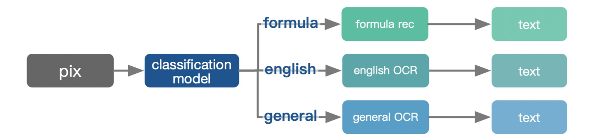
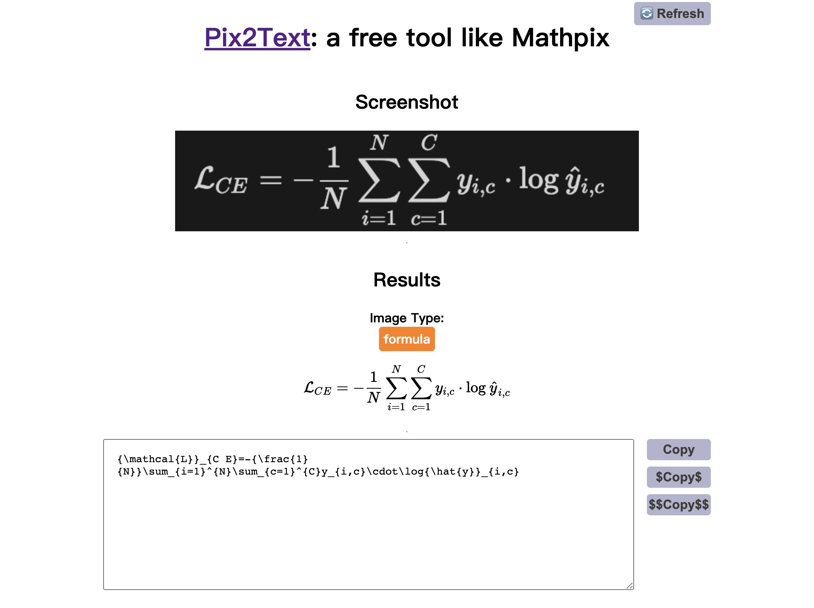

<div align="center">
  
  <div>&nbsp;</div>

[](./LICENSE)
[](https://badge.fury.io/py/pix2text)
[](https://github.com/breezedeus/pix2text)
[](https://github.com/breezedeus/pix2text)


[](https://twitter.com/breezedeus)

[🛀🏻 Online Demo](https://huggingface.co/spaces/breezedeus/pix2text) |
[💬 Contact](https://cnocr.readthedocs.io/zh/latest/contact/)

</div>

<div align="center">

[中文](./README.md) | English
</div>


# Pix2Text
**Pix2Text** is expected to be an **open source Python** alternative for **[Mathpix](https://mathpix.com/)**, accomplishing similar functionality to Mathpix. Currently Pix2Text can recognize **Math Formulas**, **English**, or **Chinese Texts** in screenshot images. The following is the procedure.

<div align="center">
  
</div>


Pix2Text first trains a **image classification model** to determine the image type, then based on different image types, the image is sent to different recognition systems for text recognition: 

1. If the image type is `formula`, which means the image is a mathematical formula, then [LaTeX-OCR](https://github.com/lukas-blecher/LaTeX-OCR) is invoked to recognize the mathematical formula in the image and return its Latex representation.
1. If the image type is `english`, which means that the image contains English text, at this time the **English model** in [CnOCR](https://github.com/breezedeus/cnocr) is used to recognize the English text in it; the English model is better than the general model for screenshots of text in pure English contexts.
1. If the image type is `general`, which means that the image contains general text, at this time **general model** in [CnOCR](https://github.com/breezedeus/cnocr) is used to recognize the Chinese or English text in it.

In the future the image types will be further subdivided according to the application needs.


Welcome to scan the following code to add our assistant as a friend, note `p2t`, our assistant will regularly invite you to join the Wechat Group.

<div align="center">
  
</div>

The author also maintains **Planet of Knowledge** [**P2T/CnOCR/CnSTD Private Group**](https://t.zsxq.com/FEYZRJQ), welcome to join. The **Planet of Knowledge Private Group** will release some P2T/CnOCR/CnSTD related private materials one after another, including [**more detailed training tutorials**](https://articles.zsxq.com/id_u6b4u0wrf46e.html), **non-public models**, answers to problems encountered during usage, etc. This group also releases the latest research materials related to OCR/STD.

## Usage


Pix2Text is very simple to use and the following is an example:

```python
from pix2text import Pix2Text

img_fp = './docs/examples/formula.jpg'
p2t = Pix2Text()
out_text = p2t(img_fp)  # `p2t.recognize(img_fp)` does exactly the same thing
print(out_text)
```

The return result `out_text` is a `dict`, where the key `image_type` indicates the image classification result, and the key `text` indicates the recognized texts.


Some examples:

<table>
<tr>
<td> Image </td> <td> Pix2Text's Result </td>
</tr>
<tr>
<td>

 
</td>
<td>

```json
{"image_type": "formula",
 "text": "\\mathcal{L}_{\\mathrm{eyelid}}~\\longrightarrow"
 "\\sum_{t=1}^{T}\\sum_{v=1}^{V}\\mathcal{N}"
 "\\cal{M}_{v}^{\\mathrm{(eyelid}})"
 "\\left(\\left|\\left|\\hat{h}_{t,v}\\,-\\,"
 "\\mathcal{x}_{t,v}\\right|\\right|^{2}\\right)"}
```
</td>
</tr>
<tr>
<td>

  
</td>
<td>

```json
{"image_type": "english",
 "text": "python scripts/screenshot_daemon_with_server\n"
         "2-get_model:178usemodel:/Users/king/.cr\n"
         "enet_lite_136-fc-epoch=039-complete_match_er"}
```
</td>
</tr>
<tr>
<td>

  
</td>
<td>

```json
{"image_type": "general",
 "text": "618\n开门红提前购\n很贵\n买贵返差\n终于降价了\n"
          "100%桑蚕丝\n要买趁早\n今日下单188元\n仅限一天"}
```
</td>
</tr>
</table>


### Model Download

After installing Pix2Text, the system will **automatically download** the model files and store them in `~/.pix2text` directory when you use Pix2Text for the first time (the default path under Windows is `C:\Users\<username>\AppData\Roaming\pix2text`).

> **Note**
>
> If you have successfully run the above example, the model has completed its automatic download and you can ignore the subsequent contents of this section.

For the **classification model**, the system will automatically download the model zip file and unzip it, then put the unzipped model directory under the `~/.pix2text` directory. If the system cannot download the zip file successfully, you need manually download it from **[cnstd-cnocr-models/pix2text](https://huggingface.co/breezedeus/cnstd-cnocr-models/tree/main/models/pix2text/0.1)** to download the zip file and put it in the `~/.pix2text` directory. If the downloading process is very slow, you can also download it from [Baidu Cloud Drive](https://pan.baidu.com/s/10E_NAAWHnbcCu7tw3vnbjg?pwd=p2t0) with the extraction code ` p2t0`.

For **[LaTeX-OCR](https://github.com/lukas-blecher/LaTeX-OCR)**, the system will also automatically download the model files and store them in the `~/.pix2text/formula` directory. If the system cannot download the model files automatically, you need to download the files `weights.pth` and `image_resizer.pth` from [Baidu Cloud](https://pan.baidu.com/s/1KgFLm6iTRK0Zn8fvu2aDzQ?pwd=p2t0) and store them in the `~/.pix2text/formula` directory; the extraction code is ` p2t0`.


## Install

Well, one line of command is enough if it goes well.

```bash
pip install pix2text
```

If the installation is slow, you can specify a domestic installation source, such as using the Douban source: 

```bash
pip install pix2text -i https://pypi.doubanio.com/simple
```


If it is your first time to use **OpenCV**, then probably  the installation will not be very easy.  Bless.


**Pix2Text** mainly depends on [**CnOCR>=2.2.2**](https://github.com/breezedeus/cnocr) , and [**LaTeX-OCR**](https://github.com/lukas-blecher/LaTeX-OCR). If you encounter problems with the installation, you can also refer to their installation instruction documentations.


> **Warning** 
>
> If you have never installed the `PyTorch`, `OpenCV` python packages before, you may encounter a lot of problems during the first installation, but they are usually common problems that can be solved by Baidu/Google.

## Interfaces

### Class Initializer

Main class called [**Pix2Text**](pix2text/pix_to_text.py) , with initialization function:

```python
class Pix2Text(object):
    def __init__(
        self,
        *,
        clf_config: Dict[str, Any] = None,
        general_config: Dict[str, Any] = None,
        english_config: Dict[str, Any] = None,
        formula_config: Dict[str, Any] = None,
        thresholds: Dict[str, Any] = None,
        device: str = 'cpu',  # ['cpu', 'cuda', 'gpu']
        **kwargs,
    ):
```

The parameters are described as follows:
* `clf_config` (dict): configs for the classification model；Default: `None`，which means:

	```python
  {
        'base_model_name': 'mobilenet_v2',
        'categories': IMAGE_TYPES,
        'transform_configs': {
            'crop_size': [150, 450],
            'resize_size': 160,
            'resize_max_size': 1000,
        },
        'model_dir': Path(data_dir()) / 'clf',
        'model_fp': None  # if given, use the given model file
  }
	```
	
* `general_config` (dict): configs for the general OCR model；Default: `None`，which means: 

  ```python
  {}
  ```

* `english_config` (dict): configs for the english OCR model；Default: `None`，which means: 

  ```py
  {'det_model_name': 'en_PP-OCRv3_det', 'rec_model_name': 'en_PP-OCRv3'}
  ```

* `formula_config` (dict): configs for the math formula recognition model；Default: `None`，which means: 

  ```python
  {
      'config': LATEX_CONFIG_FP,
      'checkpoint': Path(data_dir()) / 'formula' / 'weights.pth',
      'no_resize': False
  }
  ```

* `thresholds` (dict): configs for the thresholds; Default: `None`，which means:

  ```py
  {
      'formula2general': 0.65,  # If the recognition type is `formula` but the score is less than this threshold, then change the type to `general`
      'english2general': 0.75,  # If the recognition type is `english` but the score is less than this threshold, then change the type to `general`
  }
  ```

* `device` (str): device for predictions，such as `['cpu', 'cuda', 'gpu']`; Default: `cpu`

* `**kwargs` (): reserved arguments; not used currently


### Class Function for Recognition

The text or Latex recognition of one specified image is done by invoking the class function `.recognize()` of class **`Pix2Text`**. The class function `.recognize()` is described as follows.

```py
    def recognize(self, img: Union[str, Path, Image.Image]) -> Dict[str, Any]:
        """

        Args:
            img (str or Image.Image): an image path, or `Image.Image` loaded by `Image.open()`

        Returns: a dict, with keys:
           `image_type`: image type；
           `text`: recognized texts or Latex formula

        """
```

where the input parameters are described as follows.

* `img` (`str` or `Image.Image`): the path of the image to be recognized, or the image `Image` that has been read by using `Image.open()`.


The return result is described as follows.

* `image_type`: the image type from the classification model; the values are `formula`, `english` or `general`.
* `text`: the recognized text or Latex formula.

An example given earlier.

```json
{"image_type": "general",
 "text": "618\n开门红提前购\n很贵\n买贵返差\n终于降价了\n"
          "100%桑蚕丝\n要买趁早\n今日下单188元\n仅限一天"}
```


The `Pix2Text` class also implements the `__call__()` function, which does exactly the same thing as the `.recognize()` function. That's why the following invocation is legal.

```python
from pix2text import Pix2Text

img_fp = './docs/examples/formula.jpg'
p2t = Pix2Text()
out_text = p2t(img_fp)  # do exactly the same thing as the `p2t.recognize(img_fp)`
print(out_text)
```


## HTTP Server

 **Pix2Text** adds the FastAPI-based HTTP server. The server requires the installation of several additional packages, which can be installed using the following command.

```bash
> pip install pix2text[serve]
```

Once the installation is complete, the HTTP server can be started with the following command (**`-p`** followed by the **port**, which can be adjusted as needed).


```bash
> p2t serve -p 8503
```

After the server is turned on, you can invoke the server using the following methods.


### Command Line

As an example, if the file to be recognized is `docs/examples/english.jpg`, use `curl` to invoke the server:

```bash
> curl -F image=@docs/examples/english.jpg http://0.0.0.0:8503/pix2text
```


### Python

Invoke the server as follows.

```python
import requests

image_fp = 'docs/examples/english.jpg'
r = requests.post(
    'http://0.0.0.0:8503/pix2text', files={'image': (image_fp, open(image_fp, 'rb'), 'image/png')},
)
out = r.json()['results']
print(out)
```


### Other Language

Please refer to the `curl` format for your own implementation.


## Use Script

Script [scripts/screenshot_daemon.py](scripts/screenshot_daemon.py) automatically invokes Pixe2Text to recognize formulas or texts on screenshot images. How does this work?


**Here's the process (please install Pix2Text first):**

1. Find one favorite screenshot tool that **supports storing screenshot images in a specified folder**. For example, the free **Xnip** for Mac works very well.

2. In addition to installing Pix2Text, you need to install an additional Python package **pyperclip**, which you can use to copy the recognition results into the system clipboard: 

   ```bash
   $ pip install pyperclip
   ```

3. Download the script file [scripts/screenshot_daemon.py](scripts/screenshot_daemon.py) to your computer, edit the line where `"SCREENSHOT_DIR"` is located (line `17`) and change the path to the directory where your screenshot images are stored.

4. Run this script.

   ```bash
   $ python scripts/screenshot_daemon.py
   ```


OK, now try the result with your screenshot tool. The result of the screenshot will be written to the **`out-text.html`** file in the current folder, just open this file in your browser and you will see the result.


For a more detailed introduction, please refer to the video: "[Pix2Text: A Free Python Open Source Tool to Replace Mathpix](https://www.bilibili.com/video/BV12e4y1871U)".


<div align="center">
  
</div>


> **Note**
> 
> Thanks to my colleague for helping with most of the work on this html page. There is still a lot of room for improvement, and I welcome those who are familiar with the front-end programming to help optimize this page by PR.


## A cup of coffee for the author

It is not easy to maintain and evolve the project, so if it is helpful to you, please consider [offering the author a cup of coffee 🥤](https://dun.mianbaoduo.com/@breezedeus).

---

Official code base: [https://github.com/breezedeus/pix2text](https://github.com/breezedeus/pix2text). Please cite it properly.
