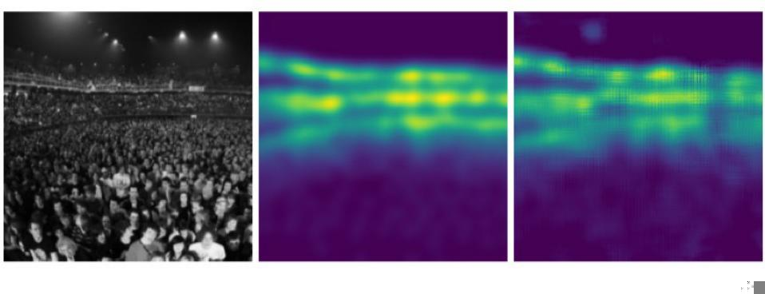
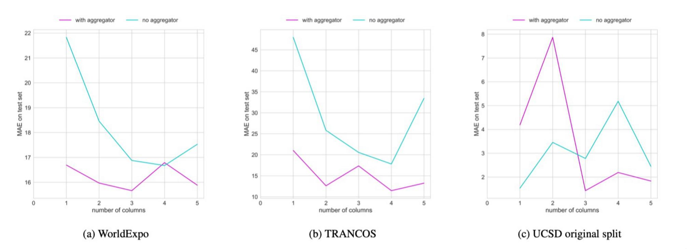

Figure 2. UCF sample results. Left: input counting image. Middle:Ground truth density map. Right:AMDCN prediction of density map on test image. The network never saw these images during training. All density maps are one channel only (i.e. grayscale), but are colored here for clarity.

of regression for production of density maps [24]. In the same spirit,[4] combines deep and shallow convolutions within the same network, providing accurate counting of dense objects (e.g. the UCF50 crowd dataset).

In this paper, however, we aim to apply the dilated convolution method of [25], which has shown to be able to incorporate multiscale perspective information without using multiple inputs or a complicated network architecture, as well as the multicolumn approach of [8, 28] to aggregate multiscale information for the counting problem.

## 3. Method

## 3.1. Dilated Convolutions for Multicolumn Networks

We propose the use of dilated convolutions as an attractive alternative to the architecture of the HydraCNN $[ 1 8 ]$ , which seems to saturate in performance at 3 or more columns. We refer to our proposed network as the aggregated multicolumn dilated convolution network', henceforth shortened as the AMDCN. The architecture of the AMDCN is inspired by the multicolumn counting network of [28]. Extracting features from multiple scales is a good idea when attempting to perform perspective-free counting and increasing the convolution kernel size across columns is an efficient method of doing so. However, the number of parameters increases exponentially as larger kernels are used in these columns to extract features at larger scales. Therefore, we propose using dilated convolutions rather than larger kernels.

Dilated convolutions, as discussed in [25], allow for the exponential increase of the receptive field with a linear increase in the number of parameters with respect to each hidden layer.

In a traditional 2D convolution, we define a real valued function $F : \mathbb{Z}^{2} \to\mathbb{R},$  an input $\Omega_{r}=[-r, r ]^{2} \in\mathbb{Z}^{2},$ and a filter function $k \, : \, \Omega_{r} \, \to\, \mathbb{R}$ In this case, a convolution operation as defined in [25] is given by

$$
( F * k ) ( \mathbf{p} )=\sum_{\mathbf{s}+\mathbf{t}=\mathbf{p}} F ( \mathbf{s} ) k ( \mathbf{t} ). \qquad\qquad( 1 )
$$

A dilated convolution is essentially a generalization of the traditional 2D convolution that allows the operation to skip some inputs. This enables an increase in the size of the filter (i.e. the size of the receptive field) without losing resolution. Formally, we define from [25] the dilated convolution as

$$
( F *_{l} k ) ( \mathbf{p} )=\sum_{\mathbf{s}+l \mathbf{t}=\mathbf{p}} F ( \mathbf{s} ) k ( \mathbf{t} ) \qquad\qquad( 2 )
$$

where $l$ is the index of the current layer of the convolution

Using dilations to construct the aggregator in combination with the multicolumn idea will allow for the construction of a network with more than just 3 or 4 columns as in [28] and [8], because the aggregator should prevent the saturation of performance with increasing numbers of columns. Therefore the network will be able to extract useful features from more scales. We take advantage of dila-tions within the columns as well to provide large receptive fields with fewer parameters.

Looking at more scales should allow for more accurate regression of the density map. However, because not all scales will be relevant, we extend the network beyond a simple $1 \times1$ convolution after the merged columns. Instead, we construct a second part of the network, the aggre-gator, which sets our method apart from [28], [8], and other multicolumn networks. This aggregator is another series of dilated convolutions that should appropriately consolidate the multiscale information collected by the columns. This is a capability of dilated convolutions observed by [25]. While papers such as [28] and [8] have shown that multiple columns and dilated columns are useful in extracting multi-scale information, we argue in this paper that the simple ag-gregator module built using dilated convolutions is able to effectively make use multiscale information from multiple columns. We show compelling evidence for these claims in Section 4.5l

The network as shown in Figure [I] contains 5 columns. Note that dilations allow us to use more columns for counting than [28] or [8]. Each column looks at a larger scale than the previous (the exact dilations can also be seen in Figure [I). There are 32 feature maps for each convolution, and all inputs are zero padded prior to each convolution in order to maintain the same data shape from input to output. That is, an image input to this network will result in a density map of the same dimensions. All activations in the specified network are ReLUs. Our input pixel values are floating point 32 bit values from 0 to 1. We center our inputs at 0 by subtracting the per channel mean from each channel. When

Figure 4. Ablation studies on various datasets in which the number of columns is varied and the aggregator is included or not included. The results generally support the use of more columns and an aggregator module.

| Method | MAE |
| --- | --- |
| AMDCN (without perspective information)  | 16.6 |
| AMDCN(with perspective information)  | 14.9 |
| LBP+RR [28] (with perspective infor-mation）  | 31.0 |
| MCNN 128 (with perspective information)  | 11.6 |
| [27] (with perspective information) | 12.9 |

Table 4. Mean absolute error of various methods on WorldExpo crowds

We obtain superior or comparable results in most of these datasets. The AMDCN is capable of outperforming these approaches completely especially when perspective information is not provided, as in UCF and TRANCOS. These results show that the AMDCN performs surprisingly well and is also robust to scale effects. Further, our ablation study of removing the aggregator network shows that using more columns and an aggregator provides the best accuracy for counting -- especially so when there is no perspective information.

## 5.2. Future Work

In addition to an analysis of performance on counting, a density regressor can also be used to locate objects in the image. As mentioned previously, if the regressor is accurate and precise enough, the resulting density map can be used to locate the objects in the image. We expect that in order to do this, one must regress each object to a single point rather than a region specified by a Gaussian. Perhaps this might be accomplished by applying non-maxima suppression to the final layer activations.

Indeed, the method of applying dilated filters to a multi-column convolutional network in order to enable extracting features of a large number of scales can be applied to various other dense prediction tasks, such as object segmentation at multiple scales or single image depth map prediction. Though we have only conducted experiments on counting and used 5 columns, the architecture presented can be extended and adapted to a variety of tasks that require information at multiple scales.

## Acknowledgment

This material is based upon work supported by the National Science Foundation under Grant No. 1359275 and 1659788. Any opinions, findings, and conclusions or recommendations expressed in this material are those of the authors and do not necessarily reflect the views of the National Science Foundation. Furthermore, we acknowledge Kyle Yee and Sridhama Prakhya for their helpful conversations and insights during the research process.

References

[1] S. An, W. Liu, and S. Venkatesh. Face recognition using kernel ridge regression. In Computer Vision and Pattern Recognition, 2007. CVPR'07. IEEE Conference on, pages 1-7. IEEE, 2007.

[2] C. Arteta, V. Lempitsky, J. A. Noble, and A. Zisser-man. Interactive object counting. In European Conference on Computer Vision, pages 504--518. Springer, 2014.

[3] D. Babu Sam, S. Surya, and R. Venkatesh Babu. Switching convolutional neural network for crowd